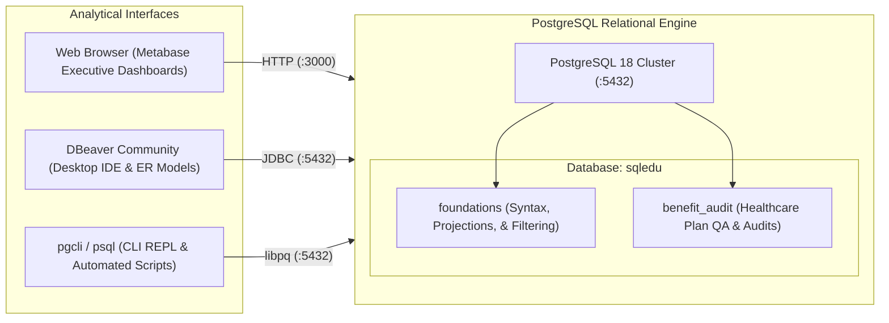

<div align="center">

# 🏛️ SQL-Edu: Relational Data Engineering & Healthcare QA Audit Laboratory

**A structured, hands-on SQL laboratory and executive portfolio specializing in database query design, data reconciliation, and healthcare benefit configuration audit governance.**

[](https://www.postgresql.org/)
[](https://www.metabase.com/)
[](https://dbeaver.io/)
[](#-curriculum-roadmap--portfolio-modules)

</div>

---

## 📖 Overview & Purpose

**`sql-edu`** documents the complete journey from **absolute beginner SQL fundamentals** to **production-grade healthcare data reconciliation and audit governance**.

Designed like an end-to-end curriculum, this repository starts from absolute ground zero—assuming zero prior programming knowledge—and methodically builds up to advanced SQL data validation, claims adjudication auditing, accumulator leakage detection, and executive scorecards using **PostgreSQL 18**, **Metabase BI**, and **DBeaver**.

---

## 🏗️ Architecture & Lab Topology



---

## 🚀 Quick Connect & Access

| Interface | Access Method | Documentation |
| :--- | :--- | :--- |
| **Metabase BI Portal** | Web Browser (`http://localhost:3000`) | [**`docs/02-metabase-setup.md`**](docs/02-metabase-setup.md) |
| **DBeaver Community** | Desktop GUI (JDBC) | [**`docs/01-connection-guide.md`**](docs/01-connection-guide.md) |
| **Interactive Terminal** | `pgcli -h <host> -U <user> -d sqledu` | [**`docs/01-connection-guide.md`**](docs/01-connection-guide.md) |

---

## 🗺️ Curriculum Roadmap & Portfolio Modules

| Phase | Module & Focus | Topics & Technical Capabilities | Status |
| :---: | :--- | :--- | :---: |
| **01** | **Lab Architecture & Learning Environment Setup** | Dedicated PostgreSQL 18 relational engine, Metabase BI service, DBeaver IDE desktop integration, and public GitHub repository implementation. |  |
| **02** | [**Absolute Beginner SQL: Zero to Query**](curriculum/01-foundations/README.md) | The mental model (Tables, Rows, Columns), declarative syntax, `SELECT`, `FROM`, column aliasing (`AS`), `WHERE` filters, `AND`/`OR`, `IN`, `BETWEEN`, `ILIKE`, `ORDER BY`, `LIMIT`, and handling `NULL` values. |  |
| **03** | **Calculated Columns, Expressions & CASE Logic** | Arithmetic operations, percentages, string functions, date manipulation (`CURRENT_DATE`, `AGE()`), and conditional branching with `CASE WHEN ... THEN ... ELSE ... END`. |  |
| **04** | **Summary Statistics, Aggregations & Grouping** | Reducing records with `COUNT(*)`, `SUM()`, `AVG()`, `MIN()`, `MAX()`, multi-column `GROUP BY`, the critical difference between `WHERE` and `HAVING`, and `FILTER (WHERE ...)`. |  |
| **05** | **Connecting Tables: Relational Joins** | Why normalize tables? Primary Keys vs. Foreign Keys, `INNER JOIN`, `LEFT JOIN`, anti-joins for discrepancy discovery, `FULL OUTER JOIN`, and `CROSS JOIN`. |  |
| **06** | [**Healthcare Plan Build Quality & Audit**](curriculum/02-benefit-configuration-audit/README.md) | Summary Plan Description (SPD) matrix validation, accumulator boundary over-accumulation ($3,600 vs $3,000 cap), post-termination claims leakage, and unauthorized inpatient surgery detection. |  |
| **07** | **Subqueries & Common Table Expressions (CTEs)** | Scalar and multi-row subqueries (`IN`, `EXISTS`), modular SQL pipelines with `WITH ... AS (...)` (CTEs), and query readability best practices. |  |
| **08** | **Window Functions & Trend Analysis** | Analytical rollups without collapsing rows: `OVER()`, `PARTITION BY`, `ROW_NUMBER()`, `RANK()`, `DENSE_RANK()`, `LEAD()`, `LAG()`, rolling 30-day trends, and cumulative spend. |  |
| **09** | **Executive Governance Scorecards & Metabase Dashboards** | First-Pass Yield (FPY %) metrics by work item type, offshore contractor vendor SLA scorecards (Cognizant, Wipro, Infosys), defect Pareto root-cause analysis, and visual BI dashboards. |  |

---

## 🏥 Healthcare QA Audit Scenarios Modeled

The [**`curriculum/02-benefit-configuration-audit/`**](curriculum/02-benefit-configuration-audit/) laboratory contains real-world audit SQL queries matching payer & TPA configuration QA:

1. **SPD vs System Configuration Discrepancy Audit**:
   Automated reconciliation comparing approved Summary Plan Descriptions against platform configuration (detecting specialist copay drifts, deductible mismatches, and disabled prior-auth flags).
2. **Accumulator Capping & Boundary Audits**:
   Identifying member claims adjudicating past their individual/family deductible or Out-of-Pocket (OOP) maximum.
3. **Eligibility Coverage Leakage Audits**:
   Detecting paid claims with service dates occurring after coverage termination dates.
4. **Offshore Vendor Governance & Scorecards**:
   Measuring First-Pass Yield (FPY %), average turnaround days, and SLA adherence across offshore audit contractors (Cognizant, Wipro, Infosys).

---

## 📂 Repository Layout

```
sql-edu/
├── README.md                                  # Executive laboratory & portfolio showcase
├── docs/                                      # Configuration & client connection guides
│   ├── 01-connection-guide.md                 # DBeaver, pgcli, and psql setup
│   └── 02-metabase-setup.md                   # Metabase BI Portal configuration
└── curriculum/                                # Progressive, hands-on SQL curriculum
    ├── 01-foundations/                        # Phase 2: Absolute Beginner SQL Foundations
    │   ├── README.md                          # Comprehensive textbook & mental models
    │   ├── 01-schema-and-seed.sql             # Reproducible DDL & sample data
    │   ├── 02-first-steps-select-and-from.sql # Lesson 1: SELECT, FROM, and aliasing (AS)
    │   ├── 03-filtering-rows-with-where.sql   # Lesson 2: WHERE, comparisons, text quotes
    │   ├── 04-combining-conditions-and-or-in.sql # Lesson 3: AND/OR, IN, BETWEEN, ILIKE
    │   ├── 05-sorting-limiting-and-nulls.sql  # Lesson 4: ORDER BY, LIMIT, and NULL logic
    │   └── 06-practice-challenges-and-solutions.sql # Lesson 5: 6 practice labs + answer key
    └── 02-benefit-configuration-audit/        # Phase 6: Healthcare Plan Build QA
        ├── README.md                          # Domain architecture & audit workflow
        ├── 01-healthcare-schema-and-seed.sql  # Plan documents, claims, & audit tables
        ├── 02-audit-reconciliation-queries.sql# Mismatch audits & accumulator leakage
        └── 03-executive-quality-scorecards.sql# FPY %, SLA adherence, & Pareto root cause
```

---

## 📜 License & Standards

- Distributed under the **MIT License**.
- Follows standard **ANSI SQL** conventions and PostgreSQL best practices.
