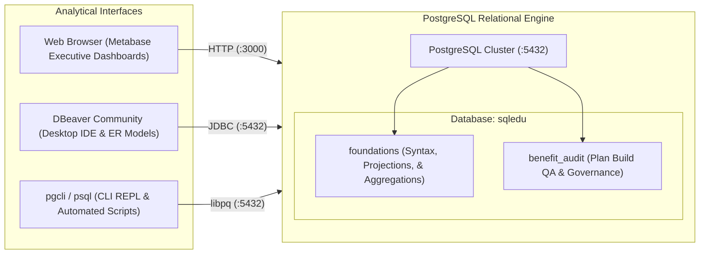

<div align="center">

# 🏛️ SQL-Edu: Relational Data Engineering & Healthcare QA Audit Laboratory

**A structured, hands-on SQL laboratory and executive portfolio specializing in database query design, data reconciliation, and healthcare benefit configuration audit governance.**

[](https://www.postgresql.org/)
[](https://www.metabase.com/)
[](https://dbeaver.io/)
[](#-curriculum-roadmap--portfolio-modules)

</div>

---

## 📖 Overview & Purpose

**`sql-edu`** documents the application of relational database engineering to real-world healthcare quality assurance, data reconciliation, and executive governance. 

This repository models complex benefit structures, audits claims adjudication logic, identifies accumulator leakage, and tracks offshore audit contractor performance scorecards using **PostgreSQL 18**, **Metabase BI**, and **DBeaver**.

---

## 🏗️ Architecture & Tooling Topology



---

## 🚀 Quick Connect & Access

| Interface | Access Method | Documentation |
| :--- | :--- | :--- |
| **Metabase BI Portal** | Web Browser (`http://localhost:3000`) | [**`docs/02-metabase-setup.md`**](docs/02-metabase-setup.md) |
| **DBeaver Community** | Desktop GUI (JDBC) | [**`docs/01-connection-guide.md`**](docs/01-connection-guide.md) |
| **Interactive Terminal** | `pgcli -h <host> -U <user> -d sqledu` | [**`docs/01-connection-guide.md`**](docs/01-connection-guide.md) |

---

## 🗺️ Curriculum Roadmap & Portfolio Modules

| Phase | Module & Focus | Topics & Technical Capabilities | Status |
| :---: | :--- | :--- | :---: |
| **01** | [**SQL Foundations & Core Syntax**](curriculum/01-foundations/README.md) | Logical execution order, projection, `WHERE` filtering, 3VL `NULL` logic, `GROUP BY`, `HAVING`, and aggregate functions. |  |
| **02** | [**Healthcare Plan Build Quality & Audit**](curriculum/02-benefit-configuration-audit/README.md) | SPD matrix validation, accumulator boundary over-accumulation, post-termination claims leakage, offshore vendor SLA tracking, and First-Pass Yield (FPY %). |  |
| **03** | **Advanced Joins & Relational Integrity** | Multi-table joins, anti-joins for discrepancy detection, self-joins, cross joins for benefit tier matrix permutation. |  |
| **04** | **Subqueries, CTEs & Recursive Hierarchies** | Correlated subqueries, Common Table Expressions, recursive hierarchy traversals (reporting trees, benefit riders). |  |
| **05** | **Window Functions & Trend Analysis** | `OVER()`, `PARTITION BY`, `ROW_NUMBER()`, `RANK()`, `LEAD()`, `LAG()`, rolling 30-day defect trends, cumulative claims spend. |  |
| **06** | **Performance Tuning & Query Execution Plans** | `EXPLAIN (ANALYZE, BUFFERS)`, indexing strategies (B-Tree, GIN, Partial Indexes), join cost optimization. |  |

---

## 🏥 Healthcare QA Audit Scenarios Modeled

The [**`curriculum/02-benefit-configuration-audit/`**](curriculum/02-benefit-configuration-audit/) laboratory contains real-world audit SQL queries matching payer & TPA configuration QA:

1. **SPD vs System Configuration Discrepancy Audit**:
   Automated reconciliation comparing approved Summary Plan Descriptions against platform configuration (detecting specialist copay drifts, deductible mismatches, and disabled prior-auth flags).
2. **Accumulator Capping & Boundary Audits**:
   Identifying member claims adjudicating past their individual/family deductible or Out-of-Pocket (OOP) maximum.
3. **Eligibility Coverage Leakage Audits**:
   Detecting paid claims with service dates occurring after coverage termination dates.
4. **Offshore Vendor Governance & Scorecards**:
   Measuring First-Pass Yield (FPY %), average turnaround days, and SLA adherence across offshore audit contractors (Cognizant, Wipro, Infosys).

---

## 📂 Repository Layout

```
sql-edu/
├── README.md                                  # Executive laboratory & portfolio showcase
├── docs/                                      # Configuration & client connection guides
│   ├── 01-connection-guide.md                 # DBeaver, pgcli, and psql setup
│   └── 02-metabase-setup.md                   # Metabase BI Portal configuration
└── curriculum/                                # Progressive, hands-on SQL curriculum
    ├── 01-foundations/                        # Phase 1: Core syntax & aggregations
    │   ├── README.md
    │   ├── 01-schema-and-seed.sql
    │   ├── 02-queries-and-filtering.sql
    │   └── 03-aggregations-and-grouping.sql
    └── 02-benefit-configuration-audit/        # Phase 2: Healthcare Plan Build QA
        ├── README.md
        ├── 01-healthcare-schema-and-seed.sql  # Plan documents, claims, & audit tables
        ├── 02-audit-reconciliation-queries.sql# Mismatch audits & accumulator leakage
        └── 03-executive-quality-scorecards.sql# FPY %, SLA adherence, & Pareto root cause
```

---

## 📜 License & Standards

- Distributed under the **MIT License**.
- Follows standard **ANSI SQL** conventions and PostgreSQL best practices.
