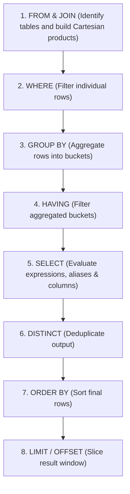

# Phase 1: SQL Foundations & Core Queries

Welcome to the beginning of your SQL mastery journey. Phase 1 establishes rock-solid intuition for the relational model, declarative query syntax, data types, filtering logic, and statistical aggregations.

---

## 🎯 Learning Objectives

By the end of this module, you will master:
1. **The Declarative Paradigm**: Understanding what to ask for rather than how to retrieve it.
2. **Execution Order vs Written Order**: Why `WHERE` cannot filter on alias names defined in `SELECT`.
3. **Core Data Types**: `INTEGER`, `BIGINT`, `NUMERIC(p,s)`, `VARCHAR`, `TEXT`, `BOOLEAN`, `DATE`, and `TIMESTAMPTZ`.
4. **Three-Valued Logic (3VL)**: How `NULL` behaves with `AND`, `OR`, `NOT`, and `IS NULL`.
5. **Set Aggregations & Grouping**: `COUNT`, `SUM`, `AVG`, `MIN`, `MAX`, `GROUP BY`, and `HAVING`.

---

## 🧠 Mental Model: SQL Logical Query Processing Order

Unlike procedural languages (Python, Go, C) which execute sequentially from top to bottom, SQL engines evaluate query clauses in a distinct logical order:



> [!IMPORTANT]
> Because **`SELECT`** is evaluated *after* **`WHERE`** and **`GROUP BY`**, you cannot reference a column alias created in `SELECT` within your `WHERE` clause!

---

## 📂 Module Files & Hands-On Exercises

| File | Description | Execution Command |
| :--- | :--- | :--- |
| [**`01-schema-and-seed.sql`**](01-schema-and-seed.sql) | DDL schema creation and mock tech company dataset (`employees`, `departments`, `projects`). | `psql -h <database-host> -U <username> -d sqledu -f 01-schema-and-seed.sql` |
| [**`02-queries-and-filtering.sql`**](02-queries-and-filtering.sql) | Core SELECT, column aliasing, mathematical expressions, `WHERE` predicates, pattern matching (`LIKE`/`ILIKE`), and `NULL` handling. | Interactive in DBeaver / `pgcli` |
| [**`03-aggregations-and-grouping.sql`**](03-aggregations-and-grouping.sql) | Statistical rollups, `GROUP BY`, multi-column grouping, and conditional filtering with `HAVING`. | Interactive in DBeaver / `pgcli` |

---

## ⚡ Quick Start: Running the Lab

From `starbuntu`, execute the seed script against `sql-edu`:

```bash
psql -h <database-host> -U <username> -d sqledu -f curriculum/01-foundations/01-schema-and-seed.sql
```

Then open **DBeaver** or start an interactive session with **`pgcli`**:

```bash
pgcli -h <database-host> -U <username> -d sqledu
```

---

## 🏆 Key Interview Takeaways

1. **`COUNT(*)` vs `COUNT(column)`**:
   * `COUNT(*)` counts the total number of rows returned, including rows with NULL values.
   * `COUNT(column)` counts only rows where the specified column is **NOT NULL**.
2. **`WHERE` vs `HAVING`**:
   * `WHERE` filters individual rows *before* aggregation occurs.
   * `HAVING` filters aggregated group records *after* `GROUP BY` has collapsed the rows.
3. **`NULL = NULL` is UNKNOWN**:
   * In SQL's three-valued logic, `NULL` represents an unknown value. It cannot equal anything, not even another `NULL`. Always use `IS NULL` or `IS NOT NULL`.
