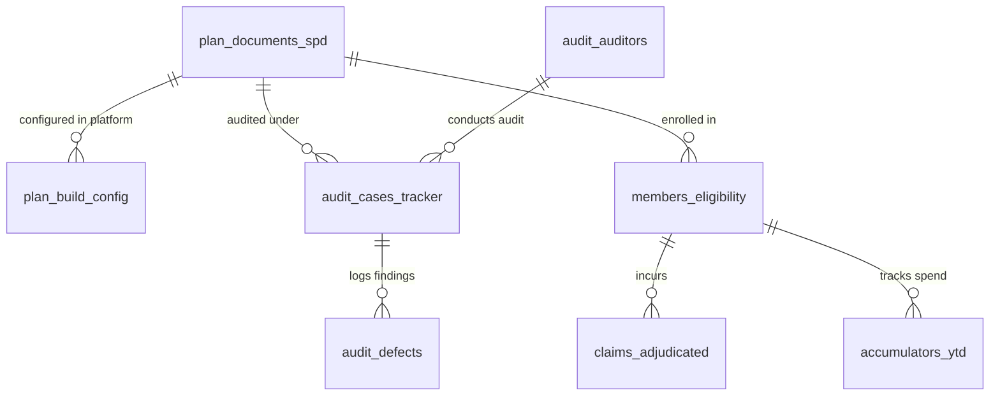

# Phase 2: Benefit Configuration Quality, Reconciliation & Audit Analytics

This module mirrors the real-world responsibilities of a **Benefit Configuration Quality and Audit Leader** in a US Healthcare Payer or TPA environment.

It establishes hands-on SQL data validation pipelines to audit plan build configurations, identify accumulator leaks, detect eligibility coverage gaps, and surface executive scorecards for distributed and offshore audit teams.

---

## 🎯 Domain & Operational Objectives

1. **Benefit Matrix & SPD Validation**:
   Compare approved Summary Plan Descriptions (SPDs) against platform configuration tables (Facets / CPBRE / PEX) to detect discrepancies in deductibles, copays, coinsurance, and prior authorization flags.
2. **Accumulator Boundary Auditing**:
   Identify members whose claims adjudicated past their deductible or Out-of-Pocket (OOP) maximums due to accumulator mapping or capping failures.
3. **Eligibility & Claims Reconciliation**:
   Catch post-termination claims leakage by cross-referencing claims service dates with member enrollment termination dates.
4. **Offshore QA Governance & SLA Analytics**:
   Aggregate audit queue cycle times, SLA compliance rates, first-pass yield (FPY %), and defect Pareto root-cause trends across offshore contractor teams.

---

## 🏛️ Schema Architecture (`benefit_audit`)



### Table Definitions:

| Table | Domain Role |
| :--- | :--- |
| **`plan_documents_spd`** | **Ground Truth Matrix**: Approved benefit design (deductibles, OOP max, copays, coinsurance, prior auth rules). |
| **`plan_build_config`** | **Platform Configuration**: The actual build entered by configuration teams (contains deliberate discrepancies for QA testing). |
| **`audit_auditors`** | **Auditor Roster**: 7+ offshore audit contractors across Cognizant, Wipro, Infosys + Onshore QA Lead. |
| **`audit_cases_tracker`** | **Workflow Queue**: Audit cycle times, SLA adherence, work item types (New Group, Renewal, Amendment), and First-Pass Yield. |
| **`audit_defects`** | **Defect Log**: Findings categorized by defect type (Copay, Accumulator, Prior Auth), severity, and root cause. |
| **`members_eligibility`** | **Enrollment Data**: Subscriber/dependent relationships, coverage start dates, and termination dates. |
| **`claims_adjudicated`** | **Claims Flow**: Billed, allowed, copay, deductible, coinsurance, and plan-paid amounts. |
| **`accumulators_ytd`** | **Accumulator Engines**: Year-to-date balances for individual/family deductibles and OOP caps. |

---

## 📂 Scripts & Practice Labs

| Script | Purpose & Key Concepts |
| :--- | :--- |
| [**`01-healthcare-schema-and-seed.sql`**](01-healthcare-schema-and-seed.sql) | DDL creation for `benefit_audit` schema, sample data, and realistic defect scenarios. |
| [**`02-audit-reconciliation-queries.sql`**](02-audit-reconciliation-queries.sql) | Audit verification queries: SPD mismatch audits, accumulator capping failures, eligibility leaks, and unauthorized surgery payments. |
| [**`03-executive-quality-scorecards.sql`**](03-executive-quality-scorecards.sql) | Executive reporting: First-pass yield (FPY %), offshore vendor SLA scorecards, and defect root-cause Pareto analysis. |

---

## ⚡ Execution in DBeaver & Terminal

Set your active schema:
```sql
SET search_path TO benefit_audit, public;
```

Or run via CLI:
```bash
psql -h <database-host> -U <username> -d sqledu -f curriculum/02-benefit-configuration-audit/02-audit-reconciliation-queries.sql
psql -h <database-host> -U <username> -d sqledu -f curriculum/02-benefit-configuration-audit/03-executive-quality-scorecards.sql
```
